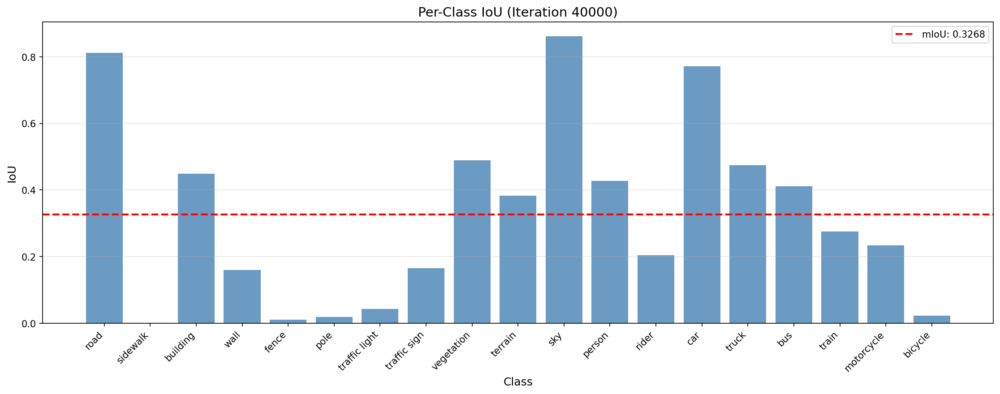

# Jittor DAFormer: 域自适应语义分割

## 1. 项目介绍

本项目是南开大学《人工智能实践课》（新芽计划）考核项目，旨在 Jittor 框架下复现 DAFormer 这一域自适应语义分割模型。

### 1.1 关于 DAFormer

DAFormer (Domain Adaptive Transformer) 是一种基于 Transformer 的域自适应语义分割方法，通过改进网络架构和训练策略，在跨域语义分割任务上取得了优异的性能。

- **原论文**: [DAFormer: Improving Network Architectures and Training Strategies for Domain-Adaptive Semantic Segmentation](https://openaccess.thecvf.com/content/CVPR2022/papers/Hoyer_DAFormer_Improving_Network_Architectures_and_Training_Strategies_for_Domain-Adaptive_Semantic_CVPR_2022_paper.pdf) (CVPR 2022)
- **原作者 GitHub 仓库**: [lhoyer/DAFormer](https://github.com/lhoyer/DAFormer?tab=readme-ov-file)

### 1.2 实现框架

原项目实现基于 [MMSegmentation](https://github.com/open-mmlab/mmsegmentation) 框架（一种基于 PyTorch 的开源语义分割工具箱），本项目实现基于 [Jittor](https://github.com/Jittor/jittor) 深度学习框架。

>  **PyTorch 简化版本**: 为了更清晰地理解模型代码，我首先编写了不依赖 MMSegmentation 的 PyTorch 训练脚本，该项目位于 [Pytorch_DAFormer](https://github.com/swiftiexh/Pytorch_DAFormer) 仓库。

## 2. 项目结构

```
Jittor_DAFormer/
├── configs/
│   ├── gta2cs_daformer.py          # 主配置文件，定义数据集、模型架构、训练策略等所有超参数
├── datasets/
│   ├── base.py                     # 数据集基类
│   ├── gta.py                      # GTA5 数据集加载器
│   ├── cityscapes.py               # Cityscapes 数据集加载器
│   └── uda_dataset.py              # 无监督域自适应数据集类，组合源域和目标域数据，支持稀有类采样 (RCS)
├── models/
│   ├── segmentor.py                # 语义分割模型的主类，包含前向传播和损失计算逻辑
│   ├── ema.py                      # 指数移动平均 (EMA) 教师模型，用于生成高质量伪标签
│   ├── backbones/
│   │   └── mit_b5.py               # MiT-B5 (Mix Transformer) 编码器，作为 DAFormer 的主干网络
│   └── decode_heads/
│       └── daformer_head.py        # DAFormer 解码头，实现多尺度特征融合和深度可分离 ASPP (Sep-ASPP)
├── trainer/
│   └── train_daformer.py           # DAFormer 训练器，实现核心的域自适应训练逻辑（自训练伪标签生成、ClassMix、特征距离正则化）
├── utils/
│   ├── checkpoint.py               # 模型权重保存和加载
│   ├── logger.py                   # 训练日志记录
│   ├── losses.py                   # 损失函数定义
│   ├── lr_scheduler.py             # 学习率调度器
│   ├── mix.py                      # 类别混合数据增强实现
│   ├── pseudo_label.py             # 伪标签生成和置信度过滤
│   ├── transform.py                # 数据预处理和增强变换
│   ├── plot_logs.py                # 训练曲线和结果可视化
│   └── convert_datasets/
│       ├── cityscapes.py           # Cityscapes 数据预处理脚本
│       └── gta.py                  # GTA5 数据预处理脚本
├── demo/
│   └── image_demo.py               # 单张图片推理演示脚本
├── pretrained/
│   └── mit_b5.pth                  # MiT-B5 预训练权重
├── work_dirs/
│   └── gta2cs_daformer_rcs_fdthings/
│       ├── iter_40000.pth          # 训练 40000 次迭代的模型检查点
│       ├── logs/                   # 训练和验证日志
│       └── plots/                  # 结果可视化图表
├── data/                           # 数据集目录（需自行下载）
│   ├── cityscapes/
│   └── gta/
├── train.py                        # 主训练脚本，负责加载配置、构建模型、组织训练流程
├── test_data.py                    # 数据加载测试脚本
├── test_model_pipeline.py          # 模型流程测试脚本
├── requirements.txt                # Python 依赖包列表
└── README.md                       # 项目说明文档
```

## 3. 数据集获取与预处理

本项目使用以下数据集进行域自适应训练：

- **源域数据集**: GTA5 (合成数据)，从 [GTA5 数据集官方页面](https://download.visinf.tu-darmstadt.de/data/from_games/) 下载所有图像和标签包，并解压到 `data/gta` 目录下。
- **目标域数据集**: Cityscapes (真实街景数据)，从 [Cityscapes 官网](https://www.cityscapes-dataset.com/downloads/) 下载`leftImg8bit_trainvaltest.zip` (原始图像) 和 `gtFine_trainvaltest.zip` (精细标注)，将下载的文件解压到 `data/cityscapes` 目录下。

最终的文件夹结构应如下所示：

```
Jittor_DAFormer/
├── data/
│   ├── cityscapes/
│   │   ├── leftImg8bit/
│   │   │   ├── train/
│   │   │   │   ├── aachen/
│   │   │   │   ├── bochum/
│   │   │   │   └── ...
│   │   │   └── val/
│   │   │       ├── frankfurt/
│   │   │       ├── lindau/
│   │   │       └── munster/
│   │   └── gtFine/
│   │       ├── train/
│   │       │   ├── aachen/
│   │       │   ├── bochum/
│   │       │   └── ...
│   │       └── val/
│   │           ├── frankfurt/
│   │           ├── lindau/
│   │           └── munster/
│   └── gta/
│       ├── images/
│       └── labels/
```

**数据预处理**：运行以下脚本，将标签 ID 转换为训练 ID，并生成稀有类采样 (RCS) 所需的类别索引：

```bash
python utils/convert_datasets/cityscapes.py data/cityscapes --nproc 8
python utils/convert_datasets/gta.py data/gta --nproc 8
```

## 4. 环境配置

本项目使用 **Python 3.8.19** 进行开发和测试。

### 4.1 安装依赖

使用以下命令安装所需依赖项：

```bash
pip install -r requirements.txt
```

### 4.2 安装 Jittor CUDA 支持

通过 Jittor 官方工具安装 CUDA 支持：

```bash
python3.8 -m jittor_utils.install_cuda
```

本项目在 NVIDIA RTX 3090 (24GB) 硬件环境下进行训练和测试。

### 4.3 下载 Mit-b5 权重

请下载 [SegFormer](https://github.com/NVlabs/SegFormer/issues/151) 提供的 MiT ImageNet 权重（b5），将其放入 `pretrained/` 文件夹中。

> 原链接已失效，在 issue 中找到了可用的权重。

## 5. 训练

### 5.1 开始训练

使用以下命令启动训练：

```bash
python train.py --config configs/gta2cs_daformer.py
```

训练过程中，模型权重和日志将保存在 `work_dirs/gta2cs_daformer_rcs_fdthings/` 目录下。

### 5.2 监控训练进度

训练日志以 JSON 格式保存，可以使用提供的可视化工具查看：

```bash
python utils/plot_logs.py --log_dir work_dirs/gta2cs_daformer_rcs_fdthings/logs
```

### 5.3 断点续训

本项目支持断点续训功能（正确性有待进一步验证），可使用 `--resume` 参数指定检查点：

```bash
python train.py --config configs/gta2cs_daformer.py --resume work_dirs/gta2cs_daformer_rcs_fdthings/iter_38500.pth
```

### 5.4 训练结果

40k Iter 的训练日志及验证结果保存在 `work_dirs/gta2cs_daformer_rcs_fdthings/logs/` 目录中。

**性能指标**：由于 Jittor 框架下的断点续训功能可能存在一定问题，在加之本次用的数据集是 1/ 4 数据集（为了和第二阶段对应），最终训练效果未达到 PyTorch 版本的性能，在 Cityscapes 验证集上达到了 **32.7% mIoU**。

**各类别 IoU 可视化**：



## 6.测试 - 单张图片推理

训练 40000 次迭代得到了检查点文件 `iter_40000.pth`（联系我获取），可运行以下命令进行单张图片的语义分割推理：

```bash
python -m demo.image_demo demo/demo.png work_dirs/gta2cs_daformer_rcs_fdthings/iter_40000.pth
```

推理结果将保存在 `demo` 目录下，包含可视化的分割结果。

---

## 致谢

感谢 Lukas Hoyer 等人在 CVPR 2022 发表的杰出工作，以及他们在 GitHub 上提供的详尽实现和文档，为本项目的复现提供了坚实的基础。

感谢南开大学《人工智能实践课》（新芽计划）的各位老师和同学，在项目实施过程中给予的指导和帮助，为代码复现工作提供了重要支持。

感谢清华大学可视计算研究中心开发的 Jittor 深度学习框架。Jittor 作为国产深度学习框架，提供了高效的计算性能和友好的 API 设计，使得本项目能够顺利完成从 PyTorch 到 Jittor 的迁移工作。Jittor 的动态编译优化和简洁的编程范式为科研工作者提供了全新的选择，期待 Jittor 在未来能够发展得更加成熟完善。

感谢 MMSegmentation 团队提供的优秀语义分割框架，以及整个开源社区为深度学习研究做出的无私贡献。